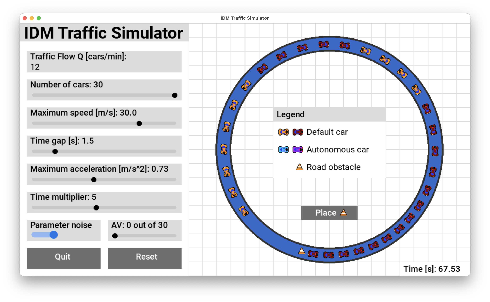

# IDM-Traffic-Simulator
Final Year Project Title: Reproducing and eliminating udesirable 
traffic phenomena using the IDM and traffic control strategies.

Developed by: Jan Slusarski 2024
## About

This is IDM Traffic Simulator! It is a traffic simulation tool created for analysis
of the commonly used Intelligent Driver Model. The program enables the user to adjust the
simulation parameters using the user interface. The preview of the simulator is presented below.

